```{r setup, include=FALSE}
library(xaringanthemer)
library(kableExtra)
library(xaringan)
library(xaringanExtra)

style_duo_accent(primary_color = "#001A57",
                 secondary_color = "#708090",
                 text_font_family = "Droid Serif",
                 text_font_url = "https://fonts.googleapis.com/css?family=Droid+Serif:400,700,400italic",
                 header_font_google = google_font("Yanone Kaffeesatz"),
                 text_slide_number_color = "#000000")
knitr::opts_chunk$set(echo = FALSE)
options("kableExtra.html.bsTable" = T)

htmltools::tagList(
  xaringanExtra::use_clipboard(
    button_text = "<i class=\"fa fa-clipboard\"></i>",
    success_text = "<i class=\"fa fa-check\" style=\"color: #90BE6D\"></i>",
    error_text = "<i class=\"fa fa-times-circle\" style=\"color: #F94144\"></i>"
  ),
  rmarkdown::html_dependency_font_awesome()
)
use_xaringan_extra(c("tile_view", "animate_css", "tachyons"))
use_scribble()
use_extra_styles(
  hover_code_line = TRUE,         
  mute_unhighlighted_code = TRUE
  )  

```  

```{css, echo=FALSE}
.remark-slide-number {
  display: none !important;
}

.incremental li {
  line-height: 1.0;
  margin-bottom: 0;
}

.remark-slide-content {
  padding-top: 1em;
}

.remark-slide-content p {
  margin-top: 0.1em;
  margin-bottom: 0.1em;
}

.remark-slide-content ul {
  margin-top: 0.1em;
  margin-bottom: 0.1em;
}

.remark-slide-content li {
  margin-top: 0em;
  margin-bottom: 0.1em;
}

.remark-slide-content li ul {
  margin-top: 0em;
  margin-bottom: 0em;
}

.remark-slide-content div > ul {
  margin-top: 0em;
  margin-bottom: 0em;
}

.remark-slide-content div > p {
  margin-top: 0.1em;
  margin-bottom: 0.1em;
}

.remark-slide-content .remark-visible {
  margin-top: 0 !important;
  margin-bottom: 0 !important;
}

.remark-slide-content > div {
  margin-top: 0 !important;
  margin-bottom: 0 !important;
  padding-top: 0 !important;
  padding-bottom: 0 !important;
}

.remark-slide-content ul {
  padding-left: 1.2em;
  margin-top: 0 !important;
  margin-bottom: 0 !important;
}

.remark-slide-content li {
  line-height: 1.15;
  margin-top: 0 !important;
  margin-bottom: 0.1em !important;
}

.remark-slide-content p {
  margin-top: 0.1em !important;
  margin-bottom: 0.1em !important;
}
.verysmall-text {
  padding-left: 1.2em;
  text-indent: -0.8em;
}
  
.col-left, .col-center, .col-right {
  width: 32%;
  float: left;
  padding: 0 0.5%;
}
```

<style>
  h2 {
    margin-bottom: 0;
  }
  h3 {
    margin-bottom: 0;
  }
  img {
    margin-top: 15px;
  }
</style>

## A Crisis of Expertise?

.pull-left[
<div style="text-align: center;">
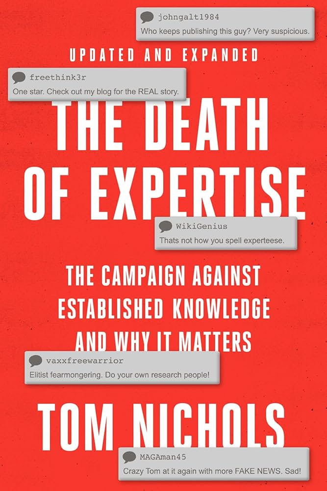
</div>
]

--

.pull-right[
<div style="text-align: center;">
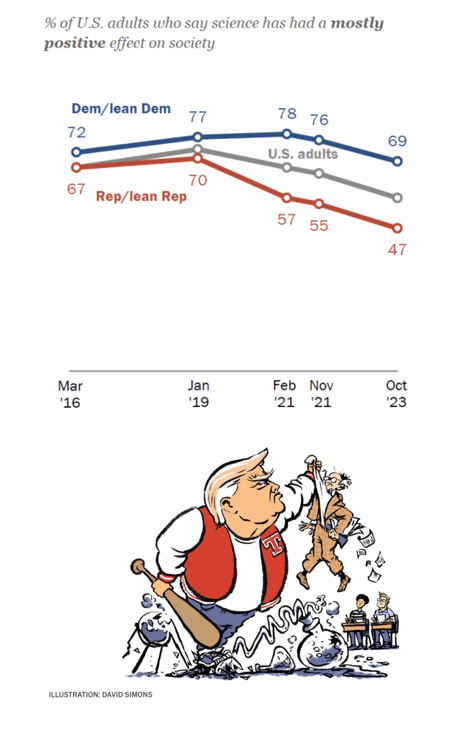
</div>
]

---

## Social Media Influence

<div style="text-align: center;">
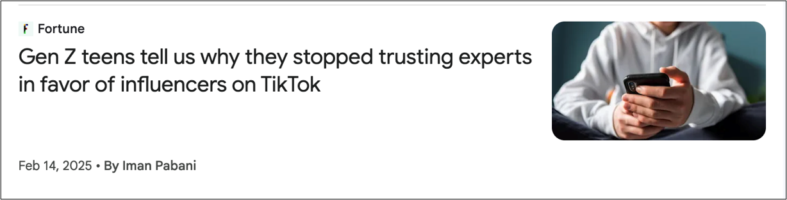
</div>

<div style="text-align: center;">

</div>

<div style="text-align: center;">
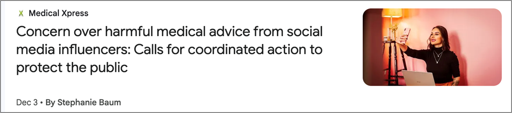
</div>


---

## Context Matters

Social media posts are not evaluated in isolation  <span class="cita">(e.g., Dounoucos, Hillygus, & Carlson 2019; Settle 2018)</span>.

--

.col-left[
<div style="text-align: center;">
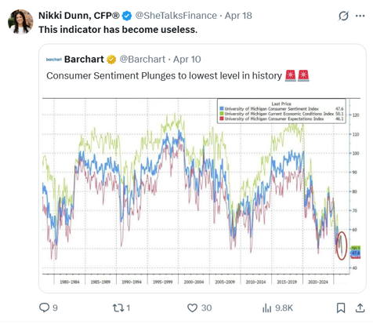
</div>
<div style="text-align: center;">

</div>
]

.col-center[
<div style="text-align: center;">
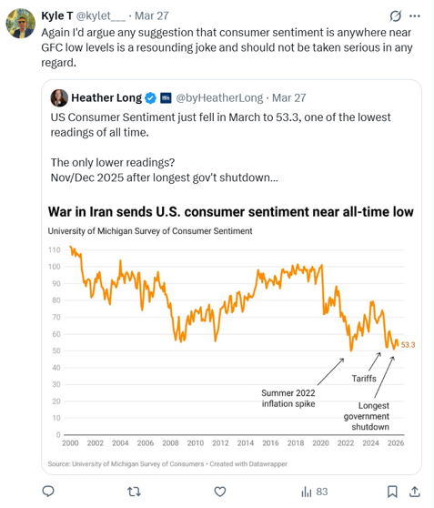
</div>
<div style="text-align: center;">
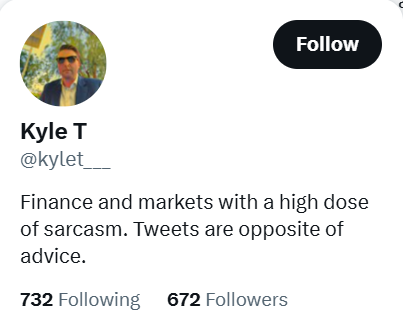
</div>
]

.col-right[
<div style="text-align: center;">
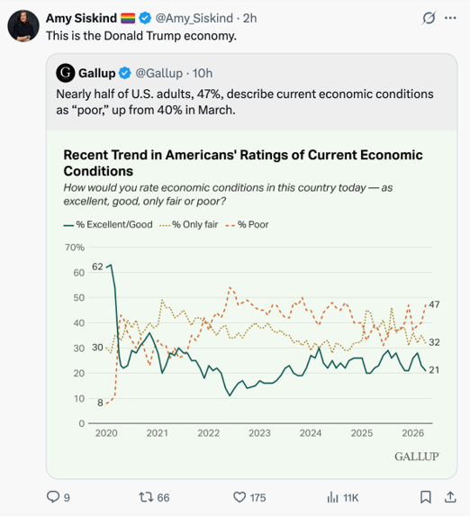
</div>
<div style="text-align: center;">
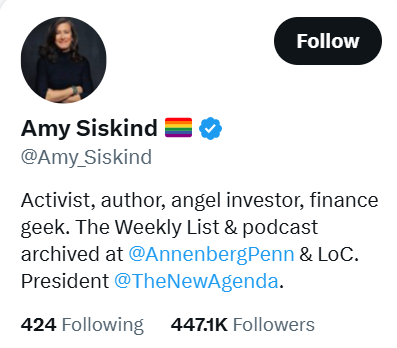
</div>
]

---

## Research Questions

<br>

--

### How do individuals evaluate .highlight[information credibility] in the complex informational environment of social media?

<br>

--

### Do .highlight[expertise] cues still matter, or are .highlight[popularity] signals more influential?


---

## Focus: Polling Statistics Reshared on Social Media

- Polls key source of political information.

--

- Perceptions of polls impact willingness to participate in surveys. Existing literature on polling credibility  <span class="cita">(e.g., Traugott 2005, Kuru et al., 2017)</span>.

--

- Has not been considered in the various layers of context in social media

--

<div style="text-align: center;">
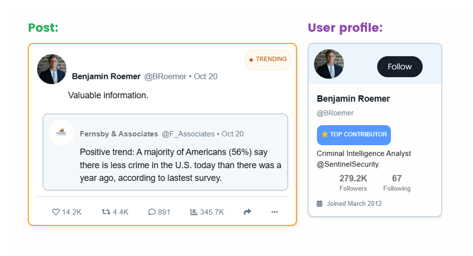
</div>

---

## Research Design

- Two pre-registered **visual-conjoint experiments**: Respondents evaluate information credibility of survey statistics reshared with user-added commentary (quotes)

--

  - .small-text[Manipulate quote type, quote author, quote popularity.]

--

- Respondents evaluated 6 posts in total (5 quoted, 1 original unquoted)

  - .small-text[Study 1 only economy statistics, Study 2 economy and crime]
  
  - .small-text[Fabricated statistics (some very close to probability-based recent results, some not). We debriefed afterwards.]


--

- Independent samples from **Prolific**: Study 1 (N = 2,014; January 2025) and Study 2 (N = 2,493; September 2025). Quotas on PID; omitted Rs if failed 2 preregistered data quality checks.

--

- Outcome measures:
  - .small-text[**Information Credibility:** Average of items for *How well do the following statements describe the polling statistic in [survey firm]'s post?* (a) .highlight[Accurate], (b) .highlight[Informative], and (c) .highlight[Trustworthy]]
  - .small-text[**Source Credibility:** Average of items for *How well do the following statements describe the user, [quote author name]?* (a) .highlight[Credible], (b) .highlight[Expert], and (c) .highlight[Biased]]


---

##  Conjoint Attributes (Original Post)

<div style="text-align: center;">
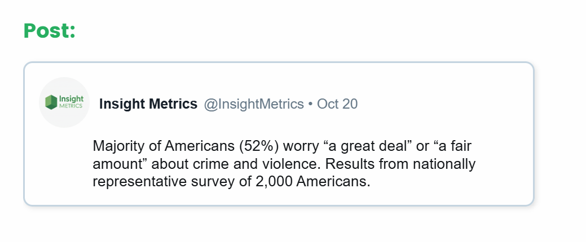
</div>

---

##  Conjoint Attributes (Example)

<div style="text-align: center;">
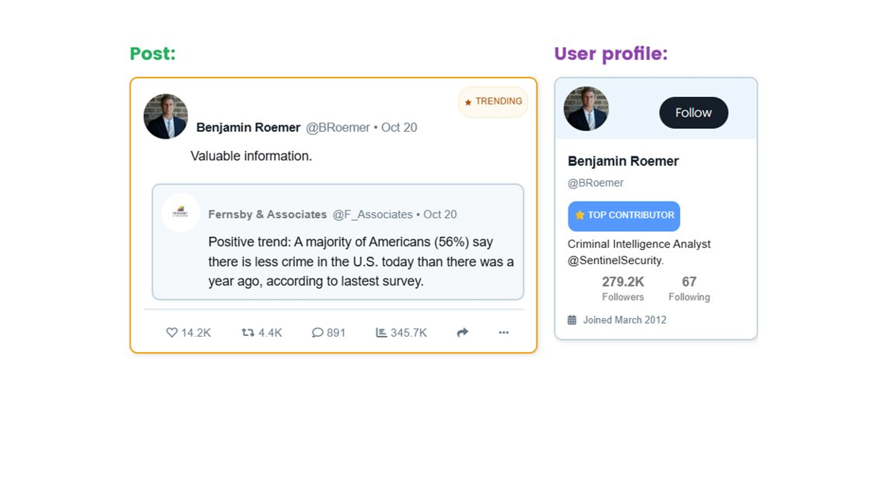
</div>

---

##  Conjoint Attributes (Quote Type)

<div style="text-align: center;">
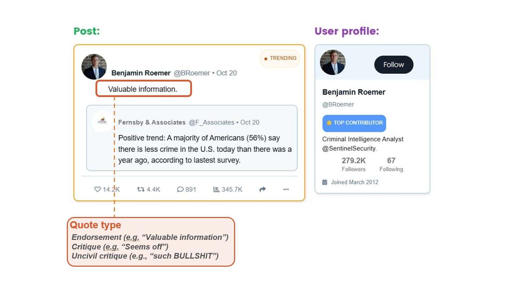
</div>

---

##  Conjoint Attributes (Quote-Author Expertise)

<div style="text-align: center;">
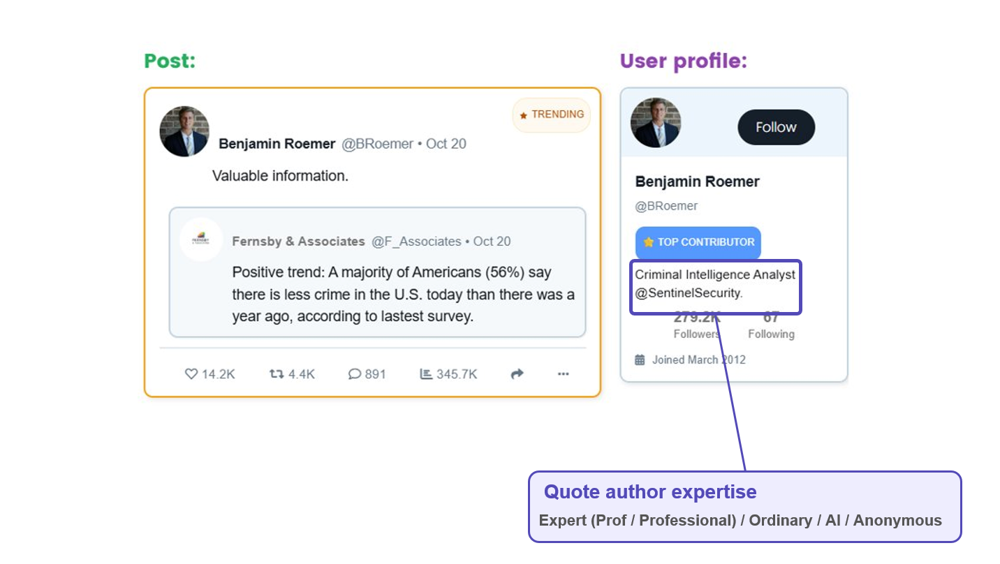
</div>

---

##  Conjoint Attributes (Quote-Author Popularity)

<div style="text-align: center;">
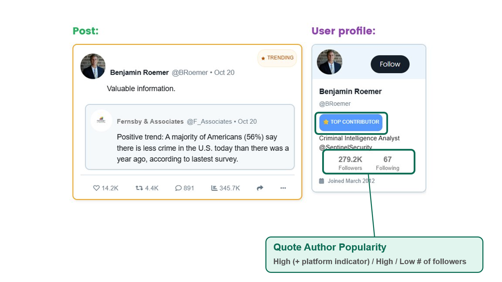
</div>


---

##  Conjoint Attributes (Quote Engagement)

<div style="text-align: center;">
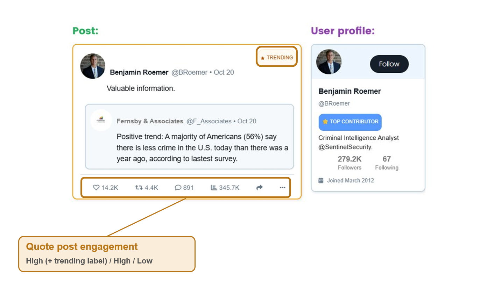
</div>


---

##  Conjoint Attributes (Information Content)

<div style="text-align: center;">
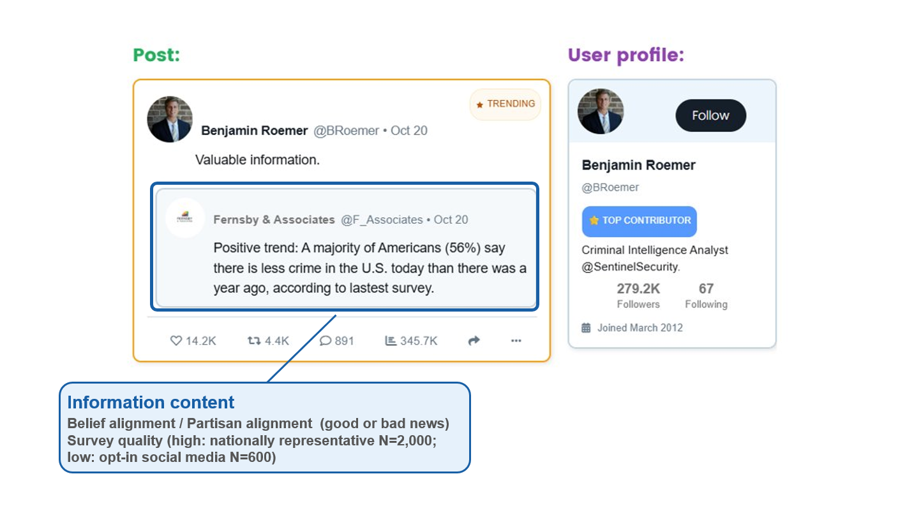
</div>


---

## Hypotheses

- **Commentary shapes credibility**: .highlight[Endorsements increase] it, .highlight[critiques decrease] it (uncivil critiques even more so)

- **Expertise > Popularity**: Expert sources increase both .highlight[source] and .highlight[statistic credibility] more than popular sources

- **Information content matters**: Survey quality, partisan alignment, and prior belief alignment increase credibility (H7)

---

## Source Credibility Results

<div style="text-align: center;">

</div>

---

## Source Credibility Results

<div style="text-align: center;">
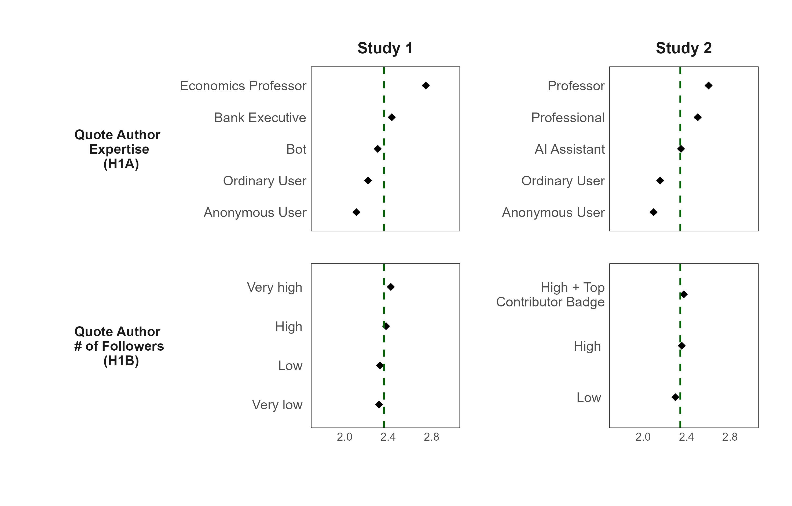
</div>

**▸ .highlight[Expertise] increases perceived user credibility; popularity has limited effects**

---

## Quote Type Results

<div style="text-align: center;">
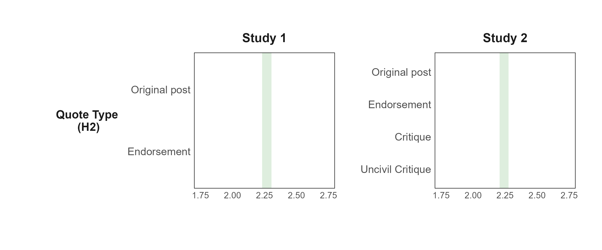
</div>

---

## Quote Type Results

<div style="text-align: center;">
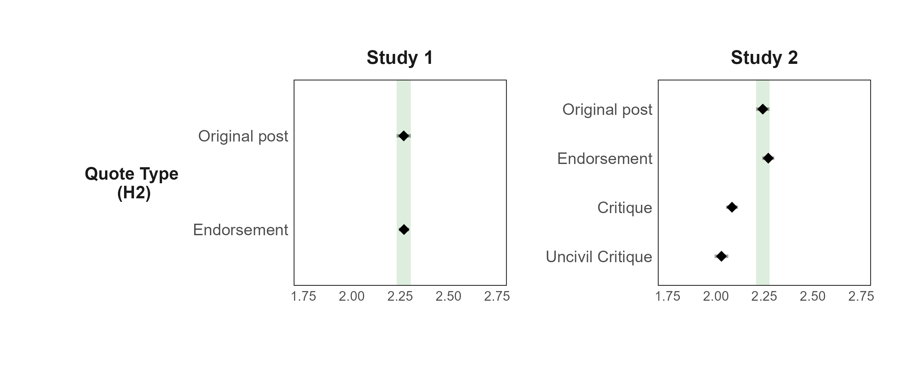
</div>

**▸.highlight[Commentary matters!] Critiques hurt credibility while endorsements rarely increase it.**

---

## Expertise vs. Popularity Results

<div style="text-align: center;">
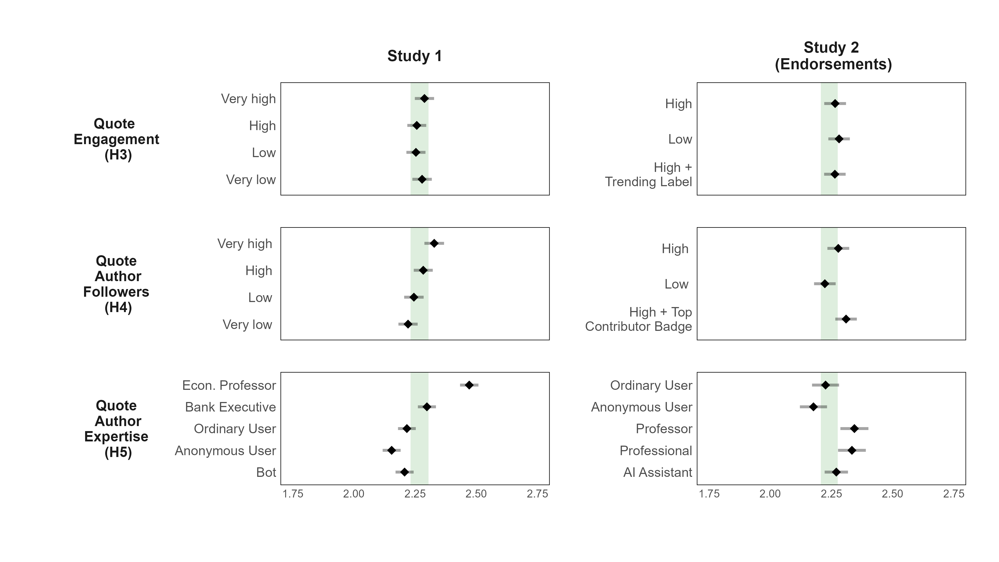
</div>

**▸ Only .highlight[expert endorsements] increase credibility.**

---

## Critiques-Specific Results

<div style="text-align: center;">
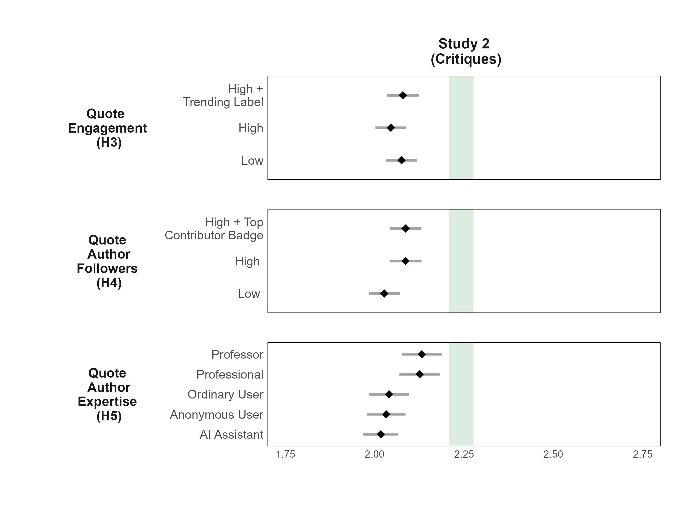
</div>

**▸ .highlight[All critiques] reduce credibility regardless of who delivers them.**

---

## Information Content Results

<div style="text-align: center;">
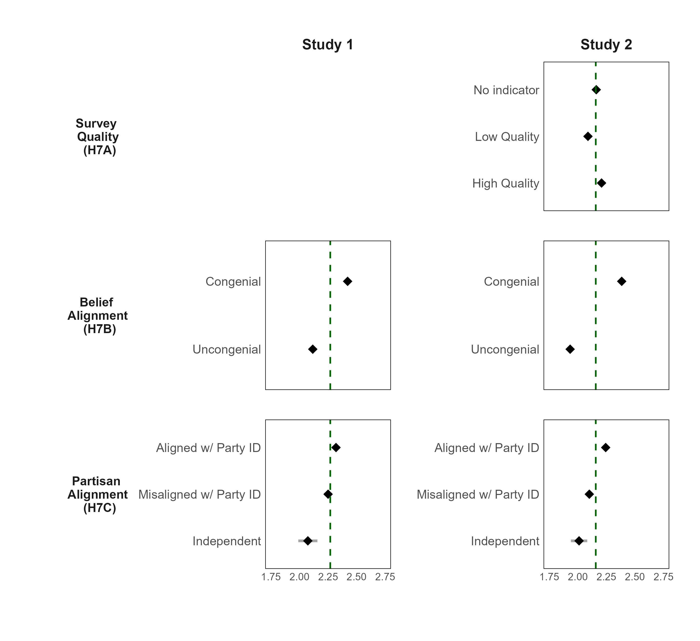
</div>

**▸ Belief alignment increases credibility; survey methodology only modestly**

---

## Discussion

--

- .highlight[Expertise still matters!]

--

  - Even among conservatives, although smaller effects

--
  - Popularity and engagement have limited impact

--
  - Prior belief alignment remains the strongest predictor overall


--

- .highlight[Undermining credibility is easier than building it]

--
  - All critiques decrease credibility, only expert endorsements increase it

--
  - Disbelief in true information may be as important as misinformation spread <span class="cita">(e.g., Altay, 2025)</span>

--

- .highlight[Some limitations]

--
  - Popularity cues were impersonal

--
  - U.S. non-probability samples; one information type (polling statistics) 

--
  - Ecological validity: static stimuli and profile visibility


---

class: inverse, center, middle

# Thanks!

### martin.opertti@duke.edu


---

## Survey Statistics

- Study 1 (only economy): (1) sociotropic current, personal current, personal retrospective, sociotropic retrospective, inflation and unemployment.

- Study 2 (economy): sociotropic retrospective, personal current, inflation perceptions. 

- Study 2 (crime): sociotropic retrospective, personal current, crime victimization. 

- Example of economic sociotropic retrospective evaluations:

  - .small-text[“*Survey shows a majority of Americans (53%) think the economy is ‘better off’ than it was a year ago.*”]
  - .small-text[“*Survey shows a majority of Americans (53%) think the economy is ‘worse off’ than it was a year ago.*”]

---

## Full Attribute Table (Part 1)

<div style="text-align: center;">
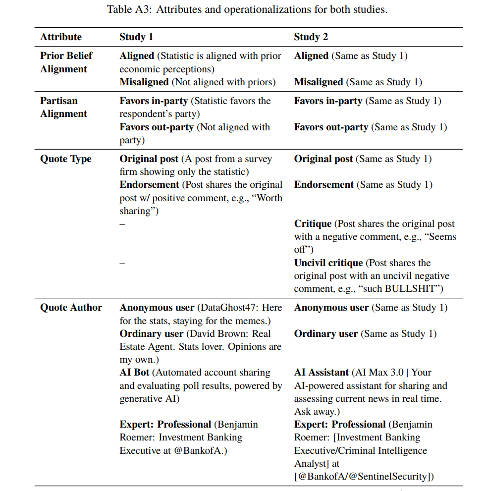
</div>

---

## Full Attribute Table (Part 2)

<div style="text-align: center;">
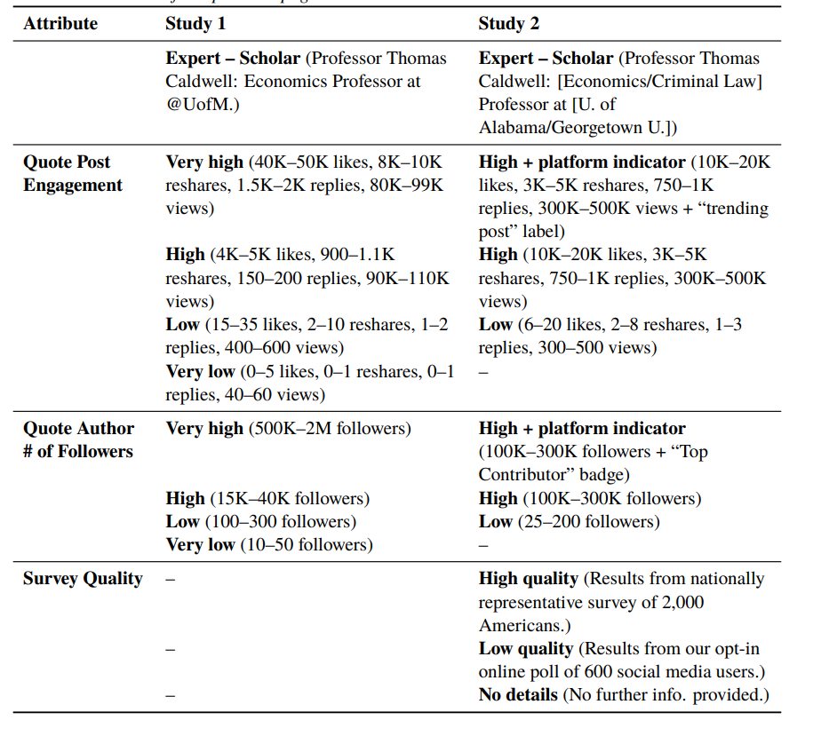
</div>

---

## Quality Flags

- **Inclusion criteria:** U.S. resident, 18 years or older, agree agree to the honesty pledge, and provided informed consent

- **Quality flags** for sensitivity analysis:
  
  - .small-text[**Speeding:** Completing the survey in less than half the median pre-treatment time.]
  - .small-text[**Attention check failure:** Failing a directed question designed to assess attention.]
  - .small-text[**Inconsistent age reporting:** Reporting an age that does not correspond to the stated birth year (± 2 years).]
  - .small-text[**Incoherent open-ended response:** Providing a non-sequitur or irrelevant answer to the openended question about issues the respondent wants the government to address.]
  - .small-text[**Fake social media platform:** Indicating use of a fictitious social media platform included as a trap item.]
  - .small-text[**Automated fraud and quality checks:** Failing any of the following Qualtrics-administered checks: duplicate ID detection, bot detection, or fraud detection.]

<div style="text-align: center;">
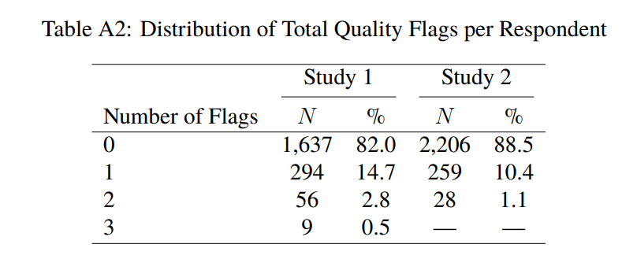
</div>

---

## Sensitivity Analysis by Response Quality

<div style="text-align: center;">

</div>

---

## Results by Partisanship

<div style="text-align: center;">

</div>

---

## Results by Statistics Accuracy


<div style="text-align: center;">

</div>

---

## Results by Expert Type

<div style="text-align: center;">

</div>

---

## Hypotheses Tests

<div style="text-align: center;">
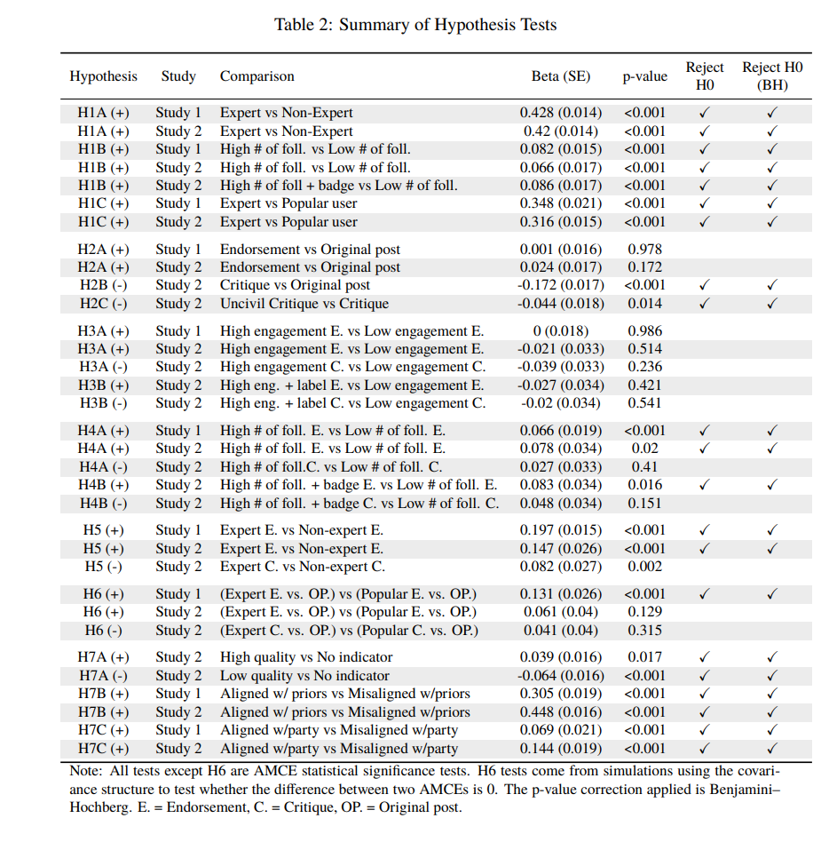
</div>

---

## Sample Demographics

<div style="text-align: center;">
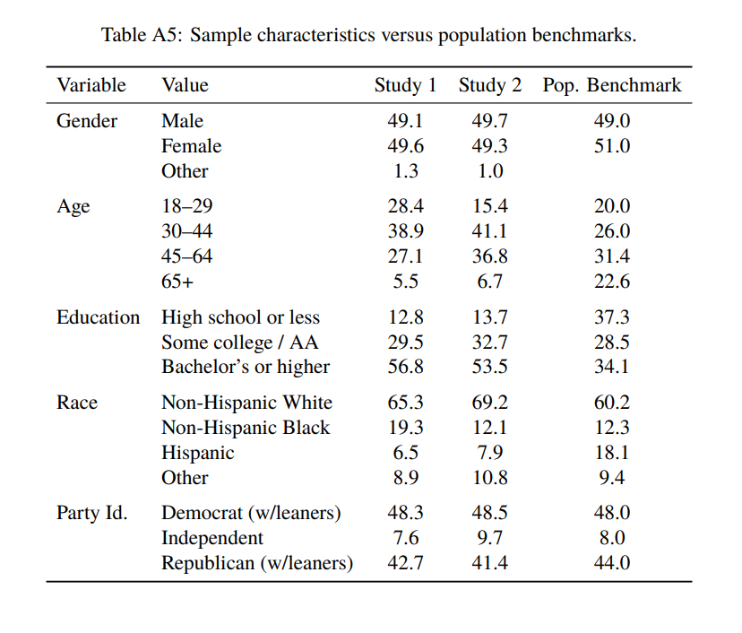
</div>


