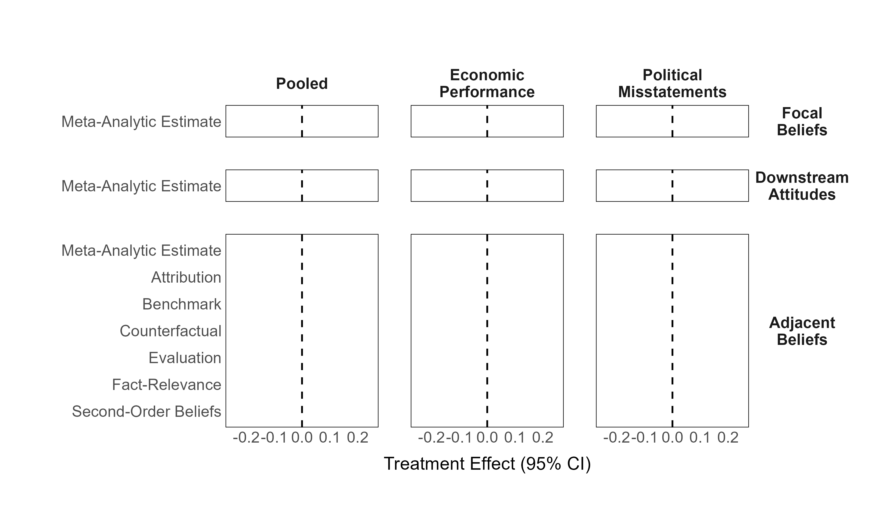
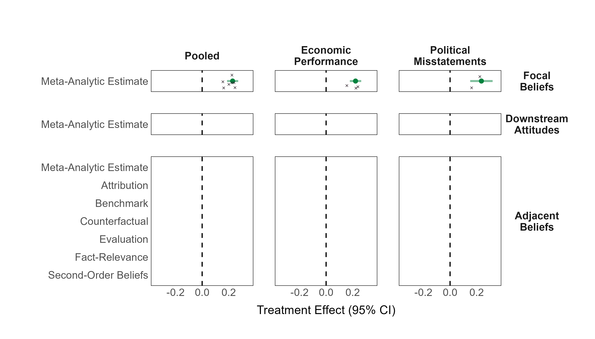
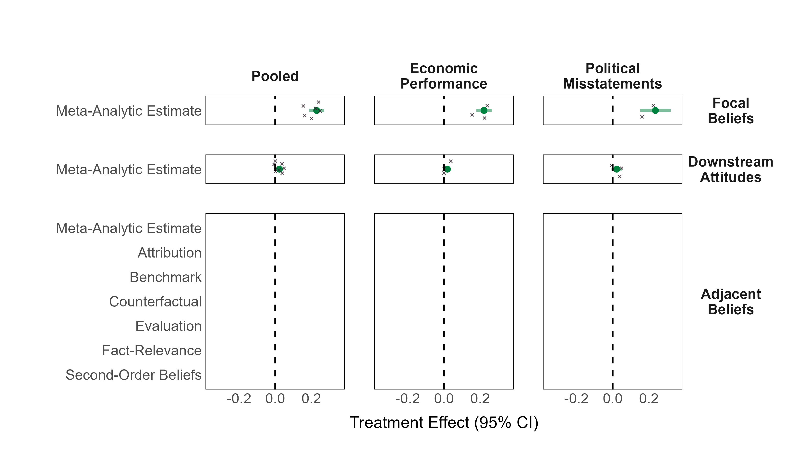
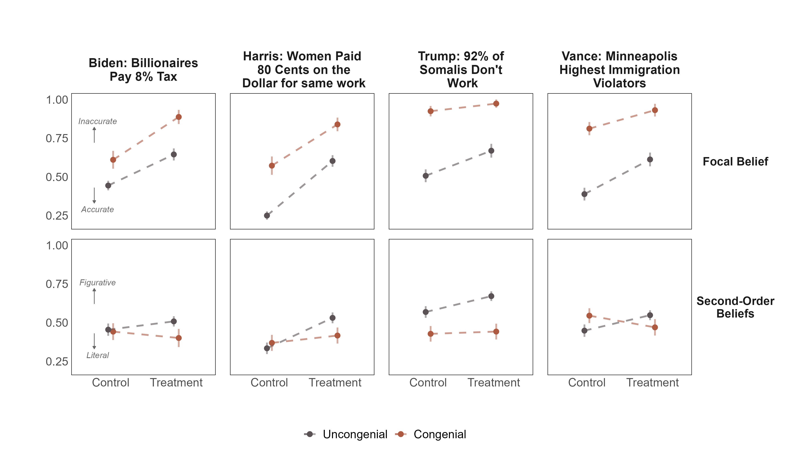
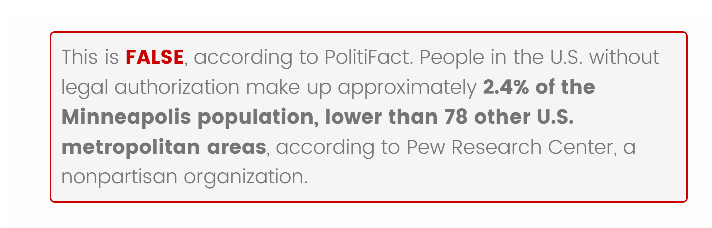
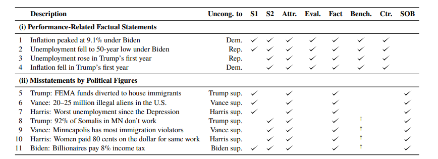
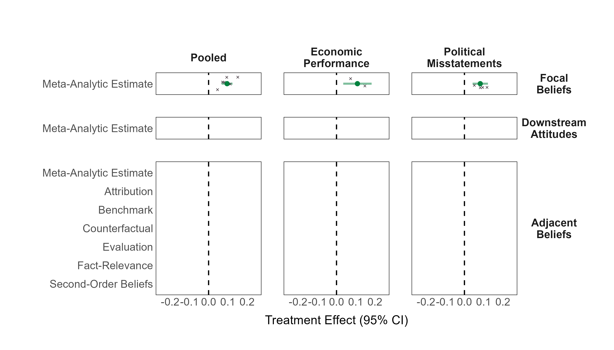
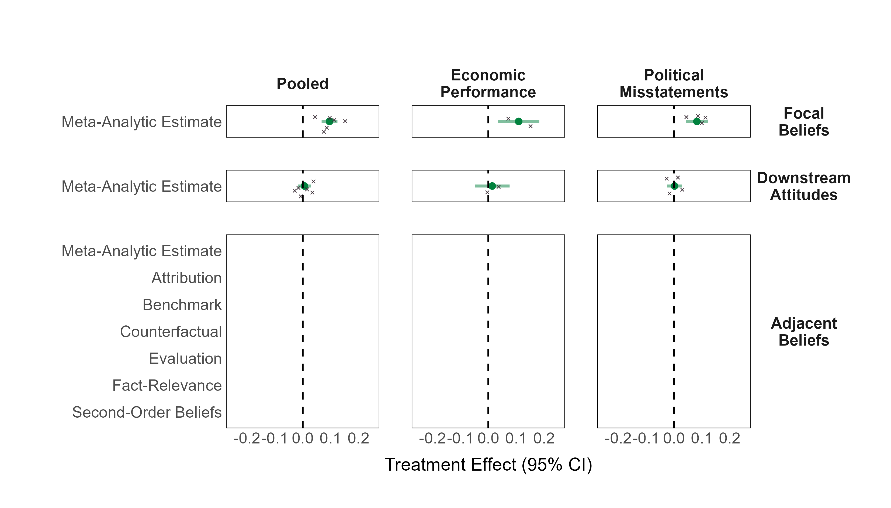
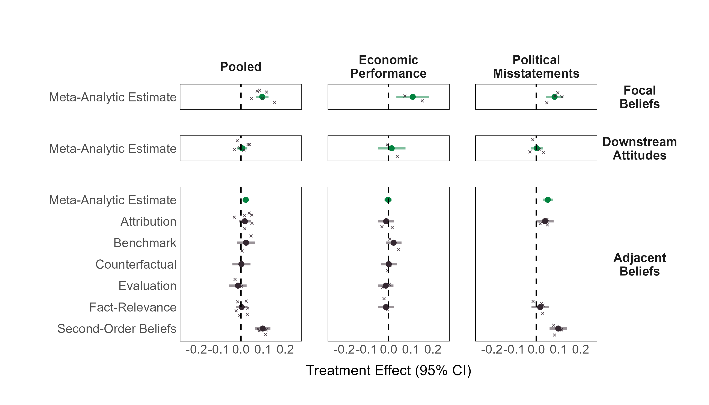

```{r setup, include=FALSE}
library(xaringanthemer)
library(kableExtra)
library(xaringan)
library(xaringanExtra)

style_duo_accent(primary_color = "#001A57",
                 secondary_color = "#708090",
                 text_font_family = "Droid Serif",
                 text_font_url = "https://fonts.googleapis.com/css?family=Droid+Serif:400,700,400italic",
                 header_font_google = google_font("Yanone Kaffeesatz"),
                 text_slide_number_color = "#000000")
knitr::opts_chunk$set(echo = FALSE)
options("kableExtra.html.bsTable" = T)

htmltools::tagList(
  xaringanExtra::use_clipboard(
    button_text = "<i class=\"fa fa-clipboard\"></i>",
    success_text = "<i class=\"fa fa-check\" style=\"color: #90BE6D\"></i>",
    error_text = "<i class=\"fa fa-times-circle\" style=\"color: #F94144\"></i>"
  ),
  rmarkdown::html_dependency_font_awesome()
)
use_xaringan_extra(c("tile_view", "animate_css", "tachyons"))
use_scribble()
use_extra_styles(
  hover_code_line = TRUE,         
  mute_unhighlighted_code = TRUE
  )  

```  

```{css, echo=FALSE}
.remark-slide-number {
  display: none !important;
}
```

<style>
  h2 {
    margin-bottom: 0;
  }
  h3 {
    margin-bottom: 0;
  }
  img {
    margin-top: 15px;
  }
</style>

## Motivation

<!-- - For citizens to hold governments accountable, they must be .highlight[responsive] to new information <span class="cita">(Carpini & Keeter, 1996; Fearon, 1999)</span>. -->

<!-- -- -->

<!-- - Yet researchers have long argued about .highlight[partisan biases] and .highlight[motivated reasoning] in information processing <span class="cita">(Campbell et al., 1960; Kunda, 1990)</span>. -->

<!-- -- -->

- .highlight[Factual corrections are effective:] When exposed to factual information, individuals .highlight[update] their beliefs in line with new information regardless of prior attitudes, often in .highlight[parallel] and .highlight[without backlash effects]  <span class="cita">(Wood and Porter, 2019; Swire et al., 2017; Coppock 2023; Nyhan et al., 2020)</span>

--

- While this has sparked optimism on voter responsiveness a key question is: .highlight[Does Factual Information Shape Downstream Attitudes?]

--

  - Existing studies suggest it .highlight[does not]. 

--

  - *“Corrections often improve belief accuracy without affecting downstream outcomes”* <span class="cita">(Porter and Wood, 2024)</span>.

--

  - This has been studied for vote choice <span class="cita">(Swire, 2017)</span>, thermometer ratings towards candidates <span class="cita">(Coppock et al., 2023)</span> and core policy attitudes <span class="cita">(Carey et al., 2024; Hopkins et al., 2019)</span>.

---

## Two Open Questions:

--

### (1) Does factual information update attitudes that are more proximate?

--

  - Assessments of the state of the economy or relevant candidate traits (i.e., honesty, competence).
  
--

### (2) What explains the disconnect between factual belief updating and attitude change?

--

  - The political meaning of a fact depends on a surrounding web of .highlight[adjacent beliefs]: .highlight[causes], .highlight[context], .highlight[significance], and .highlight[intent], that shape how it is .highlight[interpreted] and .highlight[integrated] into political judgments <span class="cita">(Gaines et al., 2007)</span>.

--

<div style="font-size: 0.9em; margin-top: 20px; margin-left: 40px;">

Claim is false &nbsp; ⟶ &nbsp; Candidate is dishonest/incompetent</br>
.small-text[(Fact)] &nbsp;&nbsp;&nbsp;&nbsp;&nbsp;&nbsp;&nbsp;&nbsp;&nbsp;&nbsp;&nbsp;&nbsp;&nbsp;&nbsp;&nbsp;&nbsp;&nbsp;&nbsp;&nbsp;&nbsp;&nbsp;&nbsp;&nbsp;&nbsp; .small-text[(Downstream Attitude)]

</div>

--

<div style="font-size: 0.9em; margin-top: 20px; margin-left: 40px;">

Claim is false &nbsp; ⟶ &nbsp; .highlight[Was speaking literally] &nbsp; ⟶ &nbsp; Candidate is dishonest/incompetent<br>
.small-text[(Fact)] &nbsp;&nbsp;&nbsp;&nbsp;&nbsp;&nbsp;&nbsp;&nbsp;&nbsp;&nbsp;&nbsp;&nbsp;&nbsp;&nbsp;&nbsp;&nbsp;&nbsp;&nbsp;&nbsp;&nbsp;&nbsp;&nbsp;&nbsp;&nbsp; .small-text[(Adjacent Belief)] &nbsp;&nbsp;&nbsp;&nbsp;&nbsp;&nbsp;&nbsp;&nbsp;&nbsp;&nbsp;&nbsp;&nbsp;&nbsp;&nbsp;&nbsp;&nbsp;&nbsp;&nbsp;&nbsp;&nbsp;&nbsp;&nbsp;&nbsp;&nbsp;&nbsp; .small-text[(Downstream Attitude)]

</div>

--

<div style="font-size: 0.9em; margin-top: 20px; margin-left: 40px;">

Claim is false &nbsp; ⟶ &nbsp; .highlight[Was speaking figuratively] ✕ Candidate is dishonest/incompetent<br>
.small-text[(Fact)] &nbsp;&nbsp;&nbsp;&nbsp;&nbsp;&nbsp;&nbsp;&nbsp;&nbsp;&nbsp;&nbsp;&nbsp;&nbsp;&nbsp;&nbsp;&nbsp;&nbsp;&nbsp;&nbsp;&nbsp;&nbsp;&nbsp;&nbsp;&nbsp; .small-text[(Adjacent Belief)] &nbsp;&nbsp;&nbsp;&nbsp;&nbsp;&nbsp;&nbsp;&nbsp;&nbsp;&nbsp;&nbsp;&nbsp;&nbsp;&nbsp;&nbsp;&nbsp;&nbsp;&nbsp;&nbsp;&nbsp;&nbsp;&nbsp;&nbsp;&nbsp;&nbsp;&nbsp;&nbsp; .small-text[(Downstream Attitude)]

</div>

--

---

## Same Facts, Different Meanings


- Factual information might trigger .highlight[congenial updating of these adjacent beliefs], possibly limiting attitude change

--

- Six dimensions of adjacent beliefs that may shape the .highlight[political interpretation] of factual information:

  - .small-text[**Attribution:** Who or what is responsible for the outcome]
  - .small-text[**Evaluation:** Subjective assessment of the magnitude of a fact]
  - .small-text[**Fact-Relevance:** How important the fact is for forming a judgment]
  - .small-text[**Benchmarks:** How the fact compares to other reference points]
  - .small-text[**Counterfactuals:** What would have happened under alternative scenarios]
  - .small-text[**Second-Order Beliefs:** Perceptions of the speaker's intent or meaning]

---

class: inverse, center, middle

# Research Design and Results

---

## Experimental Design

- Two pre-registered survey experiments on U.S. adults:
  - .small-text[**Study 1**: Verasight, N ≈ 1,250 | **Study 2**: Prolific, N ≈ 2,000]
  - .small-text[Study 2: larger sample, stronger stimuli, expanded items, congenial condition added]


--

- Respondents are presented and asked questions about two statements (study 1) or three statements (study 2) from a pool of .highlight[11 issues] in total including accurate and inaccurate statements. Two types of factual statements:
  - .small-text[**Performance**: economic indicators (e.g., "Inflation peaked at 9.1% under Biden, the highest in 40 years")]
  - .small-text[**Misstatements**: inaccurate claims by political figures (e.g., Trump: "Biden administration diverted FEMA funds to house immigrants")]

--

- Then they were randomly assigned to .highlight[factual information] or .highlight[control]
  1. .small-text[**Focal beliefs:** How accurate or inaccurate is this the factual statement]
  2. .small-text[**Downstream attitudes** economic evaluations, perceptions of politician honesty, trustworthiness and competence]
  3. .small-text[**Adjacent beliefs:** questions tailored for each dimension/statement: How much role does the President play in determining inflation? or Was [political figure] speaking literally or making a broader point?]


---

## Study 2 results (only uncongenial)

<div style="text-align: center;">

</div>

---

## Study 2 results (only uncongenial)

<div style="text-align: center;">

</div>

---

## Study 2 results (only uncongenial)

<div style="text-align: center;">

</div>

---

## Study 2 results (only uncongenial)

<div style="text-align: center;">

</div>


---

## Belief Accuracy and Perceived Intent Shifts (Study 2)

<div style="text-align: center;">

</div>

---

## Discussion

--

- Factual information shifts beliefs toward accuracy regardless of priors, but this does .highlight[not] translate (or only very modestly) into downstream attitudes, even for more proximate outcomes.

--

- However, corrections *can* trigger .highlight[adjacent belief updating].

--

  - Supporters who learn a favored politician made a false claim concede the inaccuracy but shift toward viewing the statement as figurative.

--

  - This .highlight[severs the link] between accepting the correction and judging the politician as dishonest or incompetent.

--

  - No causal link.

--

- Motivated reasoning or Bayesian updating with strong priors? I'm agnostic. (1) The distinction may be less clear than it appears. (2) The coexistence of parallel updating with .highlight[divergent interpretation] matters for voter responsiveness regardless of the underlying cognitive model.


---

class: inverse, center, middle

# Thanks!

### martin.opertti@duke.edu

---

<div style="text-align: center; margin: -5px 0;">

</div>

--

<div style="text-align: center; margin: -5px 0;">

</div>

--

<div style="text-align: center; margin: 10x 0;">

</div>


---
## Issues and Estimation

- Hierarchical linear models with random intercepts per respondent and random slopes for treatment across issues or issue-dimension pairs, to obtain .highlight[meta-analytic] average treatment effects pooled across issues.

<div style="text-align: center;">

</div>

---
## Example Measures

.pull-left[
.small-text[
**Performance: Inflation peaked at 9.1% under Biden**

.highlight[Focal belief:] How accurate is this statement?

.highlight[Downstream Attitudes:] Rate the economy under Biden / Approve the way Biden handled the economy

.highlight[Adjacent Beliefs:]
- .highlight[Attribution]: How much role does the President play in determining inflation?
- .highlight[Evaluation]: How would you rate 9% inflation?
- .highlight[Fact-Relevance]: How important is inflation for assessing the economy?
- .highlight[Benchmarks]: Rate inflation under Trump's administration
- .highlight[Counterfactuals]: What would inflation have been if Trump won in 2020?
]
]

.pull-right[
.small-text[
**Misstatement: Vance: Minneapolis has most immigration violators**

.highlight[Focal belief:] How accurate is this statement?

.highlight[Downstream Attitudes:] How well do "Honest" / "Knowledgeable" / "Trustworthy" describe Vance?

.highlight[Adjacent Beliefs:]
- .highlight[Attribution]: How justifiable is it for politicians to make exaggerated claims?
- .highlight[Fact-Relevance]: What matters more objective evidence or conveying the right message?
- .highlight[Benchmarks]: How often do Democratic leaders make false claims?
- .highlight[Second-Order Beliefs]: Was Vance speaking literally or making a broader point?
]
]

---

## Hypotheses

**H1 - Focal Beliefs:** Factual corrections will update beliefs toward accuracy, regardless of political predispositions.

--

**H2 - Downstream Attitudes:** Uncongenial corrections will .highlight[not] shift downstream attitudes (economic evaluations, honesty, competence).

--

**H3A - Adjacent Beliefs (uncongenial)**: Uncongenial corrections will trigger adjacent belief adjustment in a .highlight[predisposition-preserving] direction.

--

**H3B - Adjacent Beliefs (congenial):** Congenial corrections will trigger .highlight[no adjustment] or adjustment in the .highlight[opposite] direction (predisposition-reinforcing).


---

## Study 1 results (only uncongenial)

<div style="text-align: center;">

</div>

---

## Study 1 results (only uncongenial)

<div style="text-align: center;">

</div>

---

## Study 1 results (only uncongenial)

<div style="text-align: center;">

</div>

---

## Study 1 results (only uncongenial)

<div style="text-align: center;">

</div>

---

## Study 2 results (only congenial)

<div style="text-align: center;">

</div>


