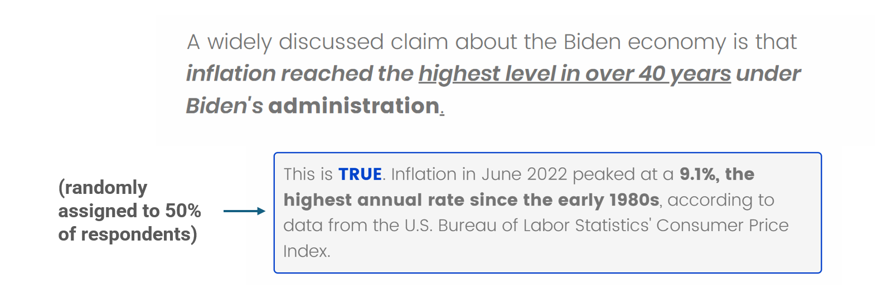

```{r setup, include=FALSE}
library(xaringanthemer)
library(kableExtra)
library(xaringan)
library(xaringanExtra)

style_duo_accent(primary_color = "#001A57",
                 secondary_color = "#708090",
                 text_font_family = "Droid Serif",
                 text_font_url = "https://fonts.googleapis.com/css?family=Droid+Serif:400,700,400italic",
                 header_font_google = google_font("Yanone Kaffeesatz"),
                 text_slide_number_color = "#000000")
knitr::opts_chunk$set(echo = FALSE)
options("kableExtra.html.bsTable" = T)

htmltools::tagList(
  xaringanExtra::use_clipboard(
    button_text = "<i class=\"fa fa-clipboard\"></i>",
    success_text = "<i class=\"fa fa-check\" style=\"color: #90BE6D\"></i>",
    error_text = "<i class=\"fa fa-times-circle\" style=\"color: #F94144\"></i>"
  ),
  rmarkdown::html_dependency_font_awesome()
)
use_xaringan_extra(c("tile_view", "animate_css", "tachyons"))
use_scribble()
use_extra_styles(
  hover_code_line = TRUE,         
  mute_unhighlighted_code = TRUE
  )  

```  

```{css, echo=FALSE}
.remark-slide-number {
  display: none !important;
}
```

<style>
  h2 {
    margin-bottom: 0;
  }
  h3 {
    margin-bottom: 0;
  }
  img {
    margin-top: 15px;
  }
</style>

## Research Interests

--

### Belief Formation, Information Processing, and Identity

--

- When citizens learn **facts** that challenge their political views, do they update their attitudes or **rationalize** the facts away?

--

- Are partisan gaps in factual beliefs just cheap talk on surveys, or do they reflect something deeper about how we reason about politics?

--

### Social Media and Politics

--

- How much do people actually live in echo chambers online?


<!-- -- -->
<!-- - When evaluating information on social media, do people rely more on source expertise or on popularity cues? -->

--

- Political content online is disproportionately created by users with more extreme views. Does exposure to this content distort perceptions of what the other side believes?

---
## Factual Corrections are Effective

<style>
  'h2 {
    margin-bottom: 0;
  }
  img {
    margin-top: -15px;
  }
</style>

<div style="text-align: center;">

</div>

---
## Factual Corrections are Effective

<div style="text-align: center;">

</div>


---

## Do Fact-Checks Change Minds Or Just Facts?

- Fact-checks reduce misperceptions (focal beliefs) <br>
.small-text[*(e.g., they correct perceptions of unemployment)*]. 

--

- But they rarely shift the **attitudes** those beliefs should inform <br>
.small-text[*(e.g., they have no effect on subjective evaluations of the economy)*.]

--

- Why? One explanation: individuals accept the corrected fact but **rationalize** it, adjusting **adjacent beliefs** to preserve their core attitudes <br>
.small-text[*(e.g., unemployment is not a relevant indicator of economic performance)*]

--

### Do individuals systematically rationalize factual corrections? 

### If so, through what strategies?


---

<style>
  'h2 {
    margin-bottom: 0;
  }
  img {
    margin-top: -115px; margin-bottom: -115px;
  }
</style>

<div style="text-align: center;">

</div>

--

- .verysmall-text[**Focal Belief:** How accurate or inaccurate do you think the following statement is? *Inflation reached the highest level in over 40 years under Biden's administration.*]

--

- .verysmall-text[**Adjacent Beliefs:**] 
  - .verysmall-text[How much of a role, if at all, does the President play in determining inflation?]
  - .verysmall-text[How important, if at all, for assessing the overall state of the economy]
  - .verysmall-text[How would you rate the inflation rate during Donald Trump's first administration (2016–2020)?]

--

- .verysmall-text[**Downstream attitudes:**] 
  - .verysmall-text[How would you rate the overall state of the nation's economy during Biden's administration?]
  - .verysmall-text[To what extent do you approve or disapprove of the way Joe Biden handled the economy during his administration?]


