```{r setup, include=FALSE}
library(xaringanthemer)
library(kableExtra)
library(xaringan)
library(xaringanExtra)

style_duo_accent(primary_color = "#001A57",
                 secondary_color = "#708090",
                 text_font_family = "Droid Serif",
                 text_font_url = "https://fonts.googleapis.com/css?family=Droid+Serif:400,700,400italic",
                 header_font_google = google_font("Yanone Kaffeesatz"),
                 text_slide_number_color = "#000000")
knitr::opts_chunk$set(echo = FALSE)
options("kableExtra.html.bsTable" = T)

htmltools::tagList(
  xaringanExtra::use_clipboard(
    button_text = "<i class=\"fa fa-clipboard\"></i>",
    success_text = "<i class=\"fa fa-check\" style=\"color: #90BE6D\"></i>",
    error_text = "<i class=\"fa fa-times-circle\" style=\"color: #F94144\"></i>"
  ),
  rmarkdown::html_dependency_font_awesome()
)
use_xaringan_extra(c("tile_view", "animate_css", "tachyons"))
use_scribble()
use_extra_styles(
  hover_code_line = TRUE,         
  mute_unhighlighted_code = TRUE
  )  

```  

```{css, echo=FALSE}
.remark-slide-number {
  display: none !important;
}
```


## About Me

--

.pull-left[

- Political Science PhD Student (Duke)

  - Polarization Lab

- Political psychology and behavior
  
  - Information processing
  
  - Rationalization 

- Social media and polarization

  - Echo chambers
  
  - Production/Consumption gap in political content and misperceptions

]

--

.pull-right[

<div style="text-align: center;">
  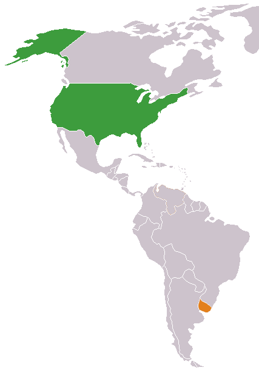
</div>

]

---

## Today's Plan

--

### 1. What do we mean when we talk about polarization? Has the U.S. polarized over the past decades?

--

### 2. What role does social media play in affective polarization?

--

### 3. The Polarization Lab and our research

---
class: inverse, center, middle

# What do we know about polarization?

---

## What do we mean when we talk about polarization? 

--

- **Ideological** vs **Affective** Polarization

  - Ideological: how strongly Democrats and Republicans diverge in their political ideals and policy goals.
  
  - Affective: the tendency to dislike or distrust the out-party and its members. 

--

- **Elite** vs **Mass** Polarization

  - Elites polarization refers to processes among political leaders, representatives, donors, activists, etc.
  
  - Mass polarization refers to processes among the whole electorate


---

## Elite Ideological Polarization

### Ideological polarization among elites has unambiguously increased, particularly among Republicans.

<div style="text-align: center;">
  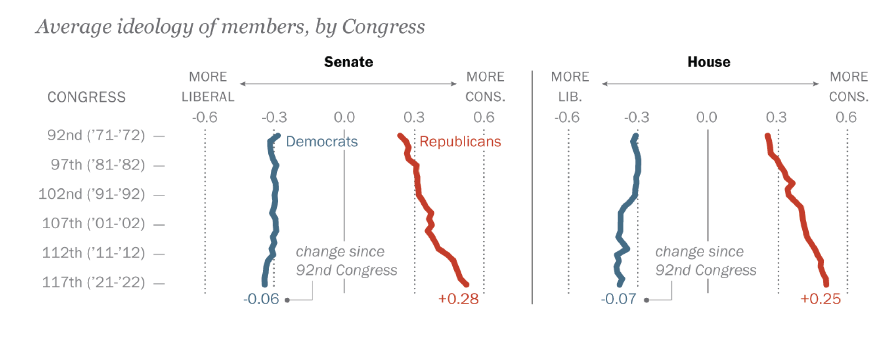
</div>

.caption[Source: Kleinfeld (2023), based on Pew Research Center Report]

---

## Mass Ideological Polarization

- More subject of debate than trends in elites.

- Individuals do not hold more extreme policy positions than they did in the 1970s, however, they have become more **sorted** into political parties: **Democrats are now consistently liberal, Republicans consistently conservative**. Two processes explain this:

  - **Realignment**: after the Civil Rights Act, conservative Southern Democrats shifted to the Republican Party, making the two parties more ideologically distinct.

  - **Elite-led sorting** <span class="cita">(Levendusky 2009)</span>: as party elites polarized and sent clearer cues, ordinary voters updated their own positions to match their party.

---

## Mass Ideological Polarization

<div style="text-align: center;">
  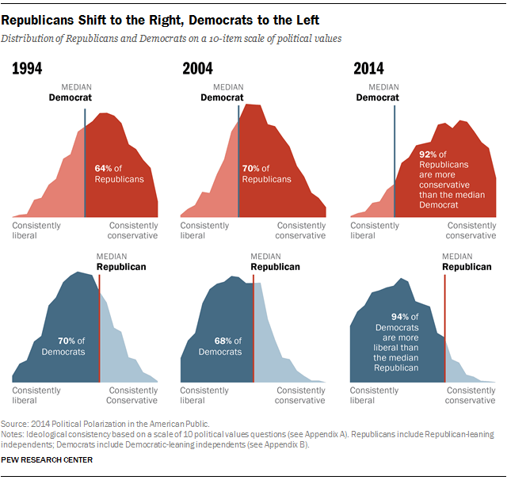
</div>

.caption[Source: Pew Research Center (2014)]

---

## Mass Affective Polarization

### Negative feelings toward the out-party have grown sharply recently

<div style="text-align: center;">
  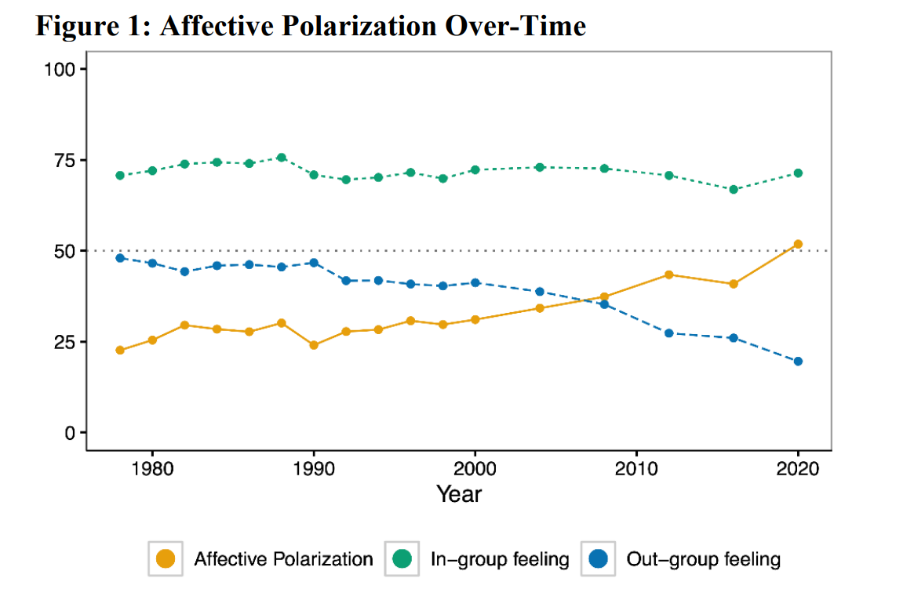
</div>

.caption[Source: Druckman and Levy (2021) based on ANES.]

---

## Mass Affective Polarization

- Affective polarization captures something distinct from policy disagreement: ordinary Americans increasingly dislike and distrust members of the opposing party <span class="cita">(Iyengar et al. 2019)</span> and out-group hate now exceeds in-group love <span class="cita">(Iyengar and Krupenkin 2018)</span>

- **Other Measurement examples:**

  - How comfortable would you be if Your [child married /neighbor was/ friend was] an opposing party member? 
  
  - Do you agree or disagree with the following statements: Democrats/Republicans are [Selfish/ Hypocritical/ Mean]

- **Consequences:**

  - Partisans more willing to tolerate norm violations and antidemocratic behavior by their own side <span class="cita">(e.g., Graham & Svolik 2019)</span>
  
  - Associated with increased support for political violence <span class="cita">(e.g. Kalmoe and Mason 2022)</span> 
  
  - Spills over into daily social life well beyond politics <span class="cita">(e.g. McConnell et al 2018)</span> 
  
---

## Affective Polarization in the World

.pull-left[

### Affective polarization trends vary widely across countries

<div style="text-align: center;">
  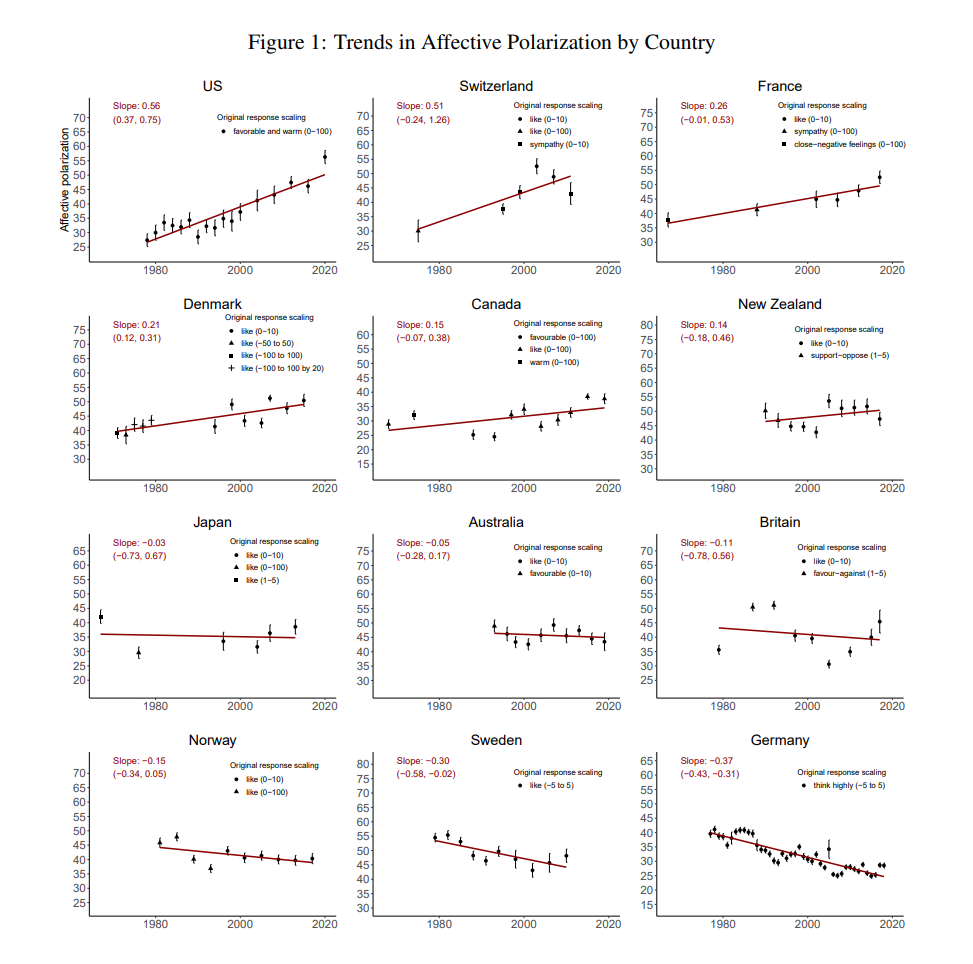
</div>

.caption[Source: Boxell et al., (2022)]
]

.pull-right[
- US rise in polarization is the highest among 12 western countries <span class="cita">(Boxell et al., 2022)</span>, but there are countries with similar levels of animosity and there is no global trend towards rising polarization  <span class="cita">(Wagner, 2024)</span>.

  - Measurement issues: multiparty systems, coalitions, etc.

- Affective polarization does not always organize around parties but on a single party, movement, or leader.

  - In Brazil, polarization is structured around support for or opposition to the PT <span class="cita">(Samuels and Zucco 2018)</span>
]
---
class: inverse, center, middle

# What role does social media play in affective polarization?


---

## Are social media echo chambers?

--

### The echo chamber hypothesis: social media traps us in ideological bubbles, shielding us from opposing views

--

.space[> .cite[For too many of us, it’s become safer to retreat into our own bubbles, (...) our social media feeds, surrounded by people who look like us and share the same political outlook and never challenge our assumptions. (...) And increasingly, we become so secure in our bubbles that we accept only information, whether true or not, that fits our opinions, instead of basing our opinions on the evidence that’s out there. ]]

.caption[Barack Obama (2017)]
  
--

- However, the evidence is not consistent with the more extreme versions of the echo chamber narratives.

  - Incidental exposure, cross-cutting engagement

<!-- - Its not relevant whether 5 or 10% of your feed is from the out-party, because what is relevant is the in-party content is portarying and engaging with particularly bad, inflamatory or extreme out-paryt content -->

<!-- - Sorting into platforms now (bluesky, truth social) -->


---

## Are social media echo chambers? Evidence from Uruguay

.pull-left[
<div style="text-align: center;">
  
</div>
]

.pull-right[

- Near-complete list of politically active Twitter users in Uruguay (~40,000)

- For each user: estimate ideology; collect follows, 200 recent tweets (incl. retweets/replies), and 150 recent likes

- Some interactions are strongly partisan; others are not

- No evidence of “isolation” from opposing views, despite a tendency toward like-minded 'positive' (e.g., retweets) interactions
]

---

## Does social media polarize us? Influential studies:

#### Allcott et al., (2024) Deactivation Study

- Treatment: deactivation of Facebook and Instagran among US sample for 6 weeks during 2020. (N = 2,684)

- Effects: no significant effect on affective polarization, small decrease in political participation and news knowledge.

<div style="text-align: center;">
  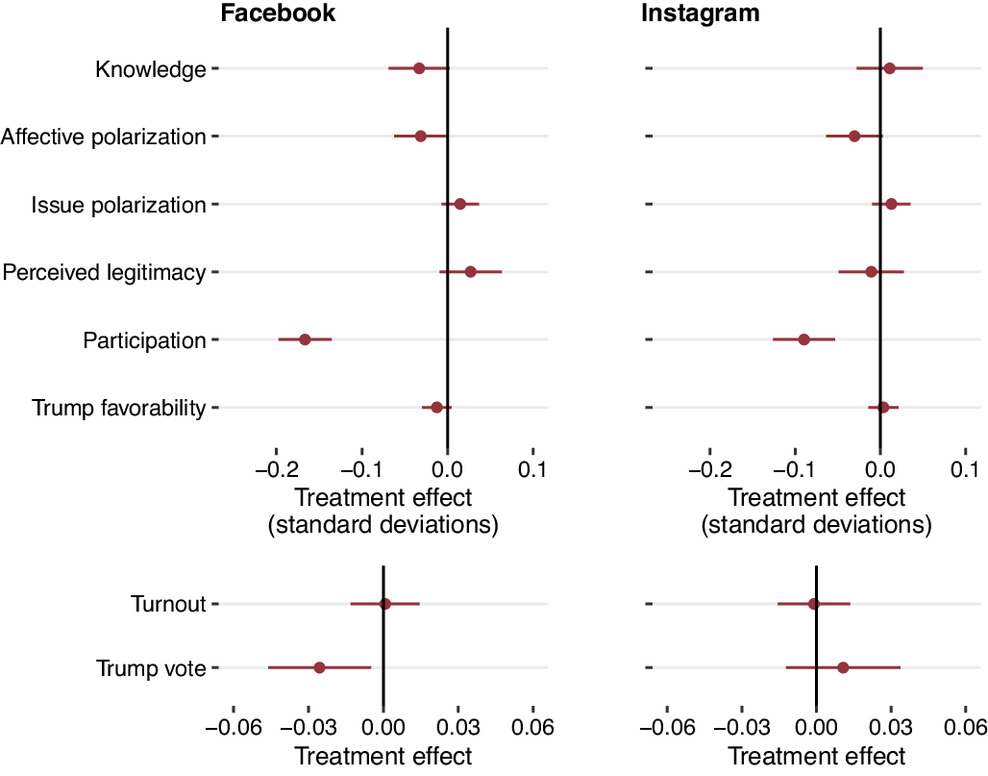
</div>

---

## Does social media polarize us? Influential studies:

#### Guess et al., (2023) Switch Ranking Algorithm to Chronological Feed

- Treatment: altering feed algorithms from personalized to chronological (Facebook: n = 23,391; Instagram: n = 21,373)

- Effects: no effect on affective or ideological polarization

<div style="text-align: center;">
  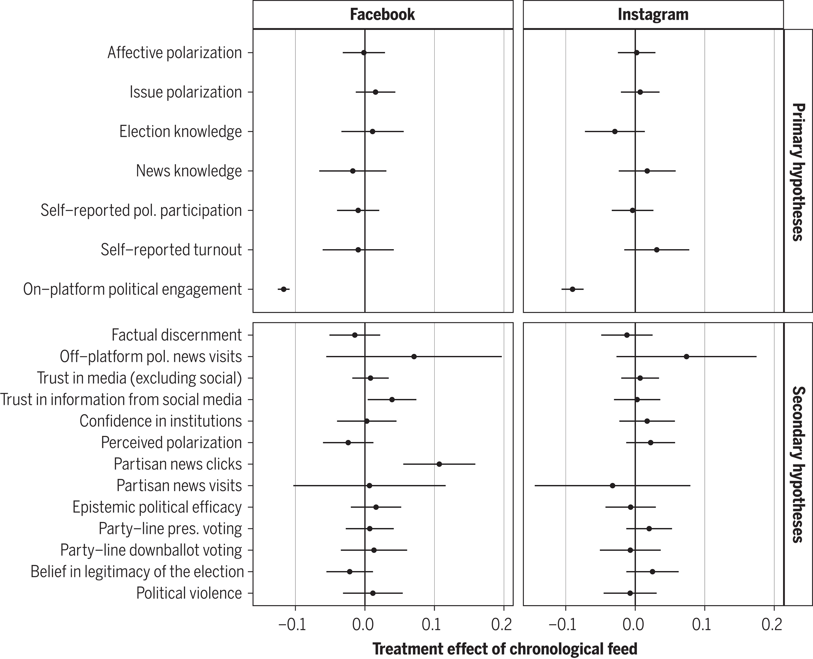
</div>


---

## Does social media polarize us? Influential studies:

#### Nyhan et al., (2023) Increase Cross-Cutting Content on Feeds

- Treatment: deprioritizing content from like-minded sources on Facebook (23,377 US-based adult Facebook )

- Effects: no effect on affective or ideological polarization

<div style="text-align: center;">
  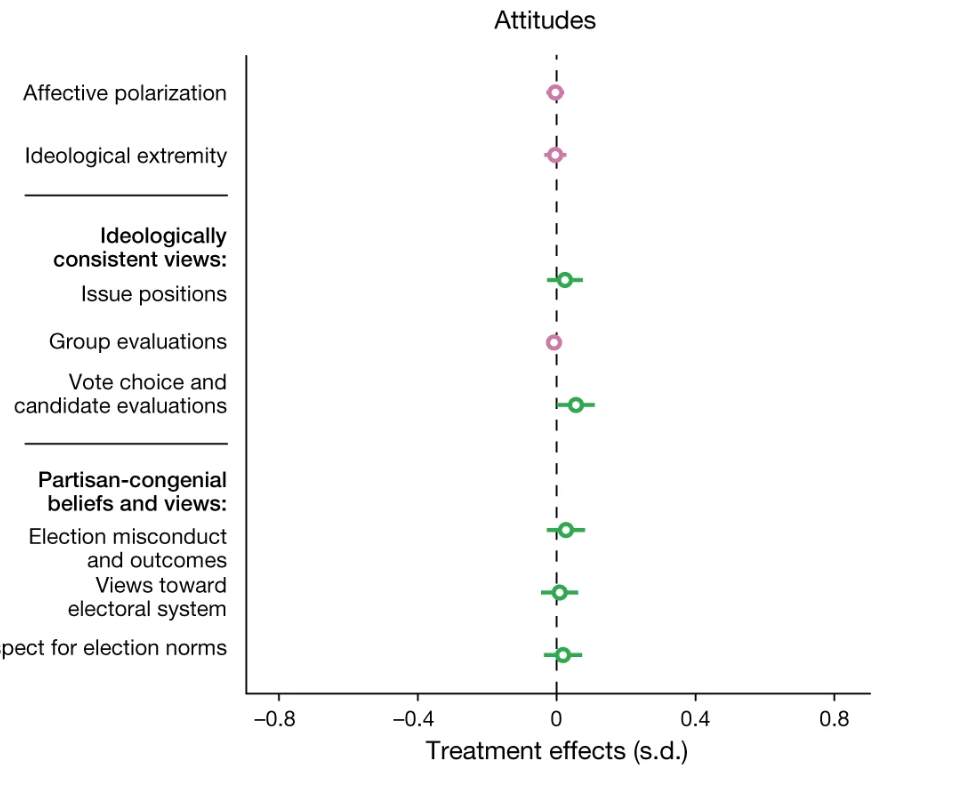
</div>


---
class: middle, center

## Should we conclude, then, that social media does not cause polarization?


---
class: inverse, center, middle

# The Polarization Lab

---

## About the Lab

- Interdisciplinary group: political science, sociology, computer science and statistical science.

- We study how technology shapes political tribalism. Specific studies on:

  - How online incivility affects conversational dynamics and party attitudes
  
  - What are the consequences of being outnumbered online (behavior in online settings dominated by out-partisans)
  
  - The impact on Russian trolls on the political attitudes of Twitter users exposed to them in the 2016 election.
  
<div style="text-align: center;">
  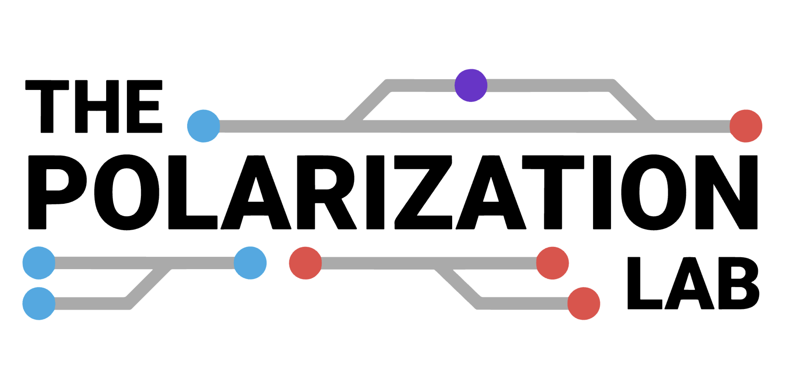
</div>

---

## Social Media Accelerator


<div style="text-align: center;">
  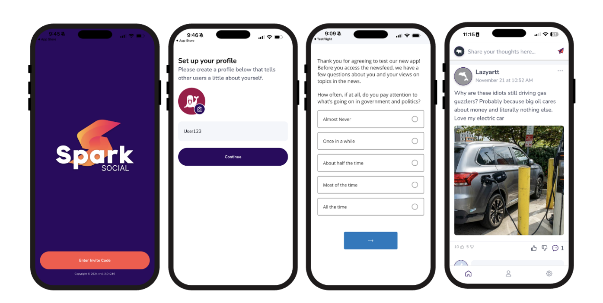
</div>

---

## Social Media Accelerator

.pull-left[

<div style="text-align: center;">
  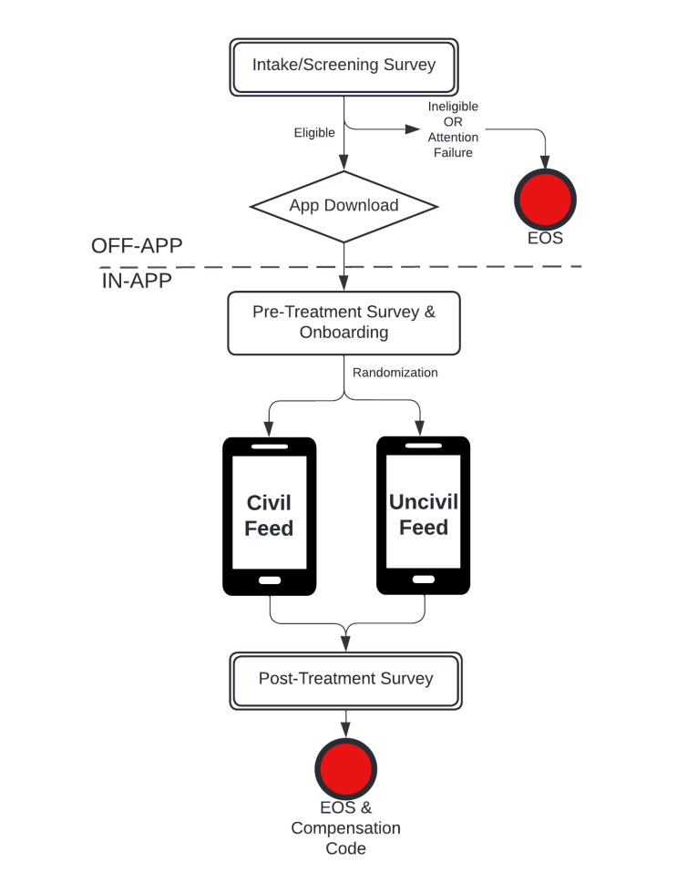
</div>

.caption[Allamong et al., (n.d.)]

]

.pull-right[

**Why do we need an SMA?**

- Platforms have restricted or eliminated (or never shared) **data access** and collaborations are problematic.

- Combines **attitudinal** (survey) and **behavioral** (app) measures

- More **realistic** than typical lab methods (e.g., showing participants screenshots rather than a live feed)

- **Flexibility** to resemble different platforms and untested affordances.

]

---

## The Consequences of the Production Consumption Gap

### Does the content we see on social media distort our perception of where the average partisan actually stands?

<div style="text-align: center;">
  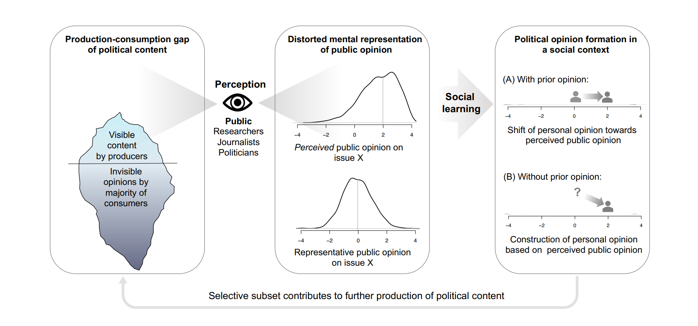
</div>

.caption[Source:  Oswald et al. (n.d.)]


---
class: inverse, center, middle

# Thank you!

