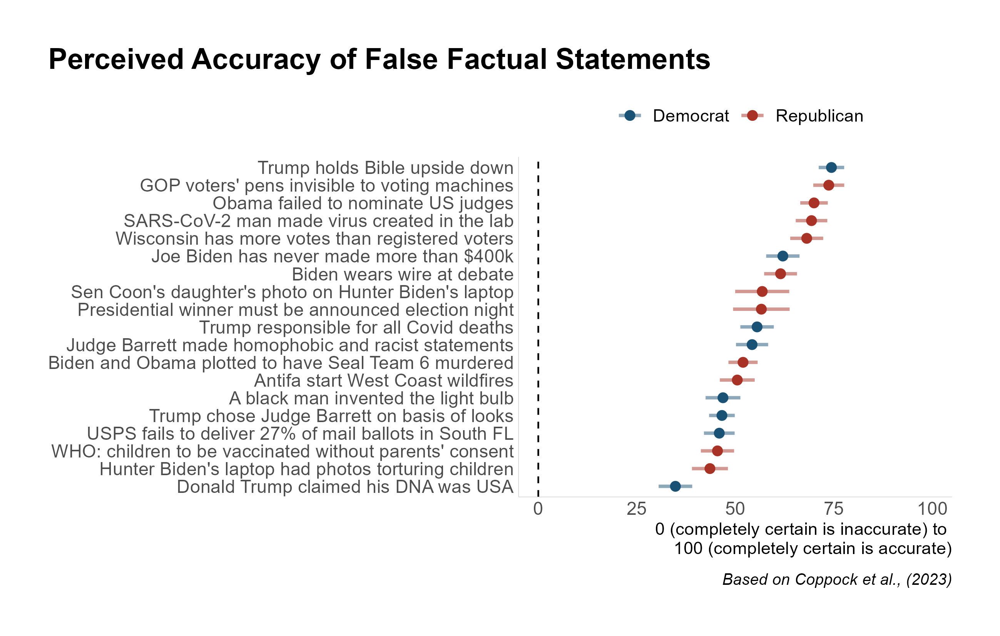
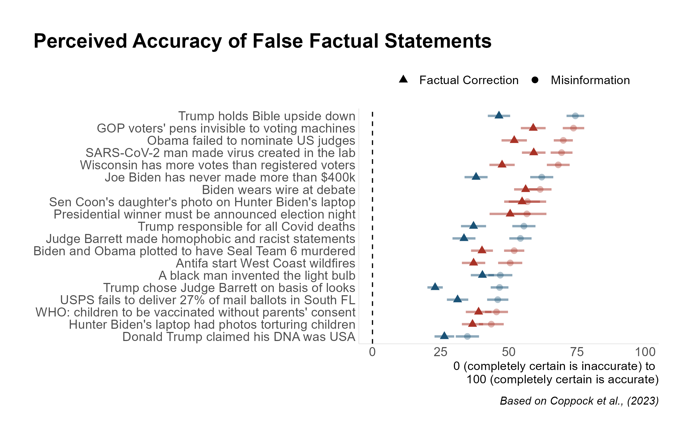
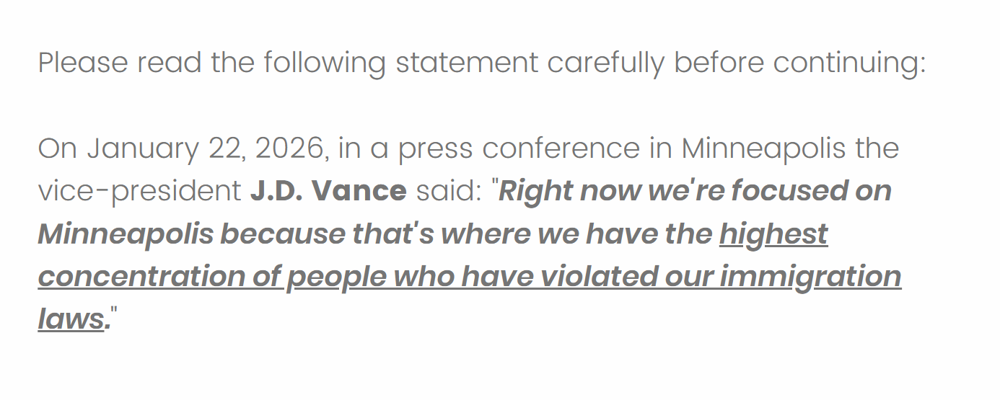
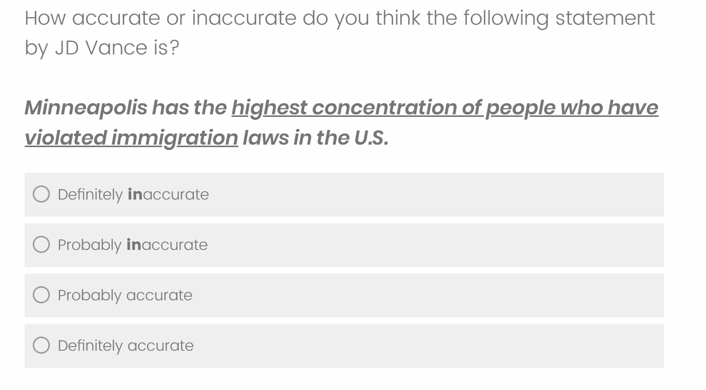
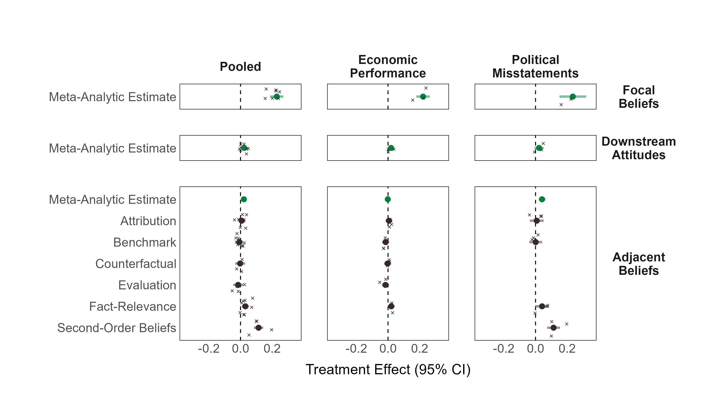
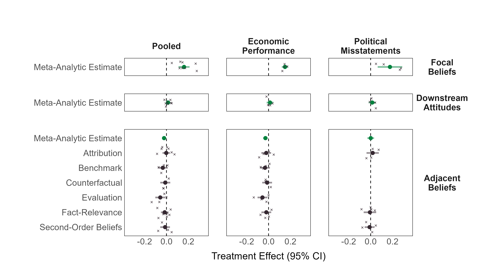

```{r setup, include=FALSE}
library(xaringanthemer)
library(kableExtra)
library(xaringan)
library(xaringanExtra)

style_duo_accent(primary_color = "#001A57",
                 secondary_color = "#708090",
                 text_font_family = "Droid Serif",
                 text_font_url = "https://fonts.googleapis.com/css?family=Droid+Serif:400,700,400italic",
                 header_font_google = google_font("Yanone Kaffeesatz"),
                 text_slide_number_color = "#000000")
knitr::opts_chunk$set(echo = FALSE)
options("kableExtra.html.bsTable" = T)

htmltools::tagList(
  xaringanExtra::use_clipboard(
    button_text = "<i class=\"fa fa-clipboard\"></i>",
    success_text = "<i class=\"fa fa-check\" style=\"color: #90BE6D\"></i>",
    error_text = "<i class=\"fa fa-times-circle\" style=\"color: #F94144\"></i>"
  ),
  rmarkdown::html_dependency_font_awesome()
)
use_xaringan_extra(c("tile_view", "animate_css", "tachyons"))
use_scribble()
use_extra_styles(
  hover_code_line = TRUE,         
  mute_unhighlighted_code = TRUE
  )  

```  

```{css, echo=FALSE}
.remark-slide-number {
  display: none !important;
}
```

<style>
  h2 {
    margin-bottom: 0;
  }
  h3 {
    margin-bottom: 0;
  }
  img {
    margin-top: 15px;
  }
</style>

## Motivation

- For citizens to hold governments accountable, they must be .highlight[responsive] to new information <span class="cita">(Carpini & Keeter, 1996; Fearon, 1999)</span>.

--

- Yet researchers have long argued about .highlight[partisan biases] and .highlight[motivated reasoning] in information processing <span class="cita">(Campbell et al., 1960; Kunda, 1990)</span>.

--

- A revisionist strand pushes back on this account:

  - .small-text[Observational equivalence between Motivated Reasoning and Bayesian updating <span class="cita">(Druckman & McGrath, 2019; Tappin, Pennycook, & Rand, 2021)</span>] 

--

  - .small-text[Partisan gaps in factual beliefs are smaller than previously assumed and incentives can further narrow them <span class="cita">(Roush and Sood, 2020; Bullock et al., 2015; Prior et al., 2015)</span>]

--

  - .small-text[More importantly: when exposed to factual information, individuals .highlight[update] their beliefs in line with new information regardless of prior attitudes, often in .highlight[parallel] and .highlight[without backlash effects]  <span class="cita">(Wood and Porter, 2019; Swire et al., 2017; Coppock 2023; Nyhan et al., 2020)</span>]

---
## Factual Corrections are Effective

<style>
  h2 {
    margin-bottom: 0;
  }
  img {
    margin-top: -15px;
  }
</style>

<div style="text-align: center;">

</div>

---
## Factual Corrections are Effective

<div style="text-align: center;">

</div>

---
## A Spark of Optimism

.cite["At least for a brief moment, their perceptual screens dim, and the facts prevail."] <span class="cita">(Porter and Wood, 2019)</span>

.cite["Persuasive information can indeed change minds"] <span class="cita">(Coppock, 2023)</span>

.cite["Motivated reasoning is not a good model of information processing"] <span class="cita">(Coppock, 2023, cited by Levendusky, 2024)</span>

.cite["Democrats and Republicans can use the same information to make collective judgments about whether to reward or punish elected officials based on performance"] <span class="cita">(Roush and Sood, 2020)</span>

.cite["Our results demonstrate that a significant portion of what scholars have called perceptual bias is in fact an artifact"] <span class="cita">(Prior, Sood and Khanna, 2015)</span>

.cite["(...) Mistaken belief that differences in what Democrats and Republicans are large enough to warrant serious concerns about democratic accountability."] <span class="cita">(Roush and Sood, 2024)</span>

---

## Does Factual Information Shape Downstream Attitudes?

--

- Existing studies suggest it .highlight[does not]. 

--

  - *“Corrections often improve belief accuracy without affecting downstream outcomes”* <span class="cita">(Porter and Wood, 2024)</span>.

--

  - This has been studied for vote choice <span class="cita">(Swire, 2017)</span>, thermometer ratings towards candidates <span class="cita">(Coppock et al., 2023)</span> and core policy attitudes <span class="cita">(Carey et al., 2024; Hopkins et al., 2019)</span>.

---

## Two Open Questions:

--

### (1) Does factual information update attitudes that are more proximate?

--

  - Assessments of the state of the economy or relevant candidate traits (i.e., honesty, competence).
  
--

### (2) What explains the disconnect between factual belief updating and attitude change?

--

  - Corrections may target beliefs that are peripheral to the attitudes they aim to change <span class="cita">(Velez et al., 2025)</span>

--

  - Alternative perspective: factual information might trigger .highlight[adjacent belief updating] that shapes the .highlight[political meaning and relevance of a fact] and its relationship with downstream attitudes.
  
---

## Same Facts, Different Meanings

- The political meaning of a fact depends on a surrounding web of beliefs: .highlight[causes], .highlight[context], .highlight[significance], and .highlight[intent], that shape how it is .highlight[interpreted] and .highlight[integrated] into political judgments <span class="cita">(Gaines et al., 2007)</span>.

--

- Framework based on scattered findings from the literatures on rationalization <span class="cita">(e.g., Bisgaard, 2015;2019; Lauderdale, 2016)</span> and Bayesian updating  <span class="cita">(e.g., Graham & Singh, 2024)</span>.

--

- Six dimensions of adjacent beliefs that may shape the .highlight[political interpretation] of factual information:

--

  - .small-text[**Attribution:** Who or what is responsible for the outcome]
  - .small-text[**Evaluation:** Subjective assessment of the magnitude of a fact]
  - .small-text[**Fact-Relevance:** How important the fact is for forming a judgment]
  - .small-text[**Benchmarks:** How the fact compares to other reference points]
  - .small-text[**Counterfactuals:** What would have happened under alternative scenarios]
  - .small-text[**Second-Order Beliefs:** Perceptions of the speaker's intent or meaning]

---

class: inverse, center, middle

# Research Design

---

## Experimental Design

- Two pre-registered survey experiments on U.S. adults:
  - .small-text[**Study 1**: Verasight, N ≈ 1,250, 2 issues | **Study 2**: Prolific, N ≈ 2,000, 3 issues]
  - .small-text[Study 2: larger sample, stronger stimuli, expanded items, congenial condition added]

--

- For each issue, respondents read a factual statement (could be accurate or inaccurate). Two types of factual statements:
  - .small-text[**Performance**: economic indicators (e.g., "Inflation peaked at 9.1% under Biden")]
  - .small-text[**Misstatements**: inaccurate claims by political figures (e.g., Trump: "FEMA funds diverted to house immigrants")]

--

- Then they were randomly assigned to .highlight[factual information] or .highlight[control], then I measure:
  1. .small-text[**Focal beliefs:** perceived accuracy of the targeted claim]
  2. .small-text[**Downstream attitudes** economic evaluations, perceptions of politician honesty and competence]
  3. .small-text[**Adjacent beliefs:** attribution, evaluation, fact-relevance, benchmarks, counterfactuals, second-order beliefs]


---

<div style="text-align: center; margin: -5px 0;">

</div>

--

<div style="text-align: center; margin: -5px 0;">

</div>

--

<div style="text-align: center; margin: 10x 0;">

</div>


---
## Example Measures

.pull-left[
.small-text[
**Performance: Inflation peaked at 9.1% under Biden**

.highlight[Focal belief:] How accurate is this statement?

.highlight[Downstream Attitudes:] Rate the economy under Biden / Approve the way Biden handled the economy

.highlight[Adjacent Beliefs:]
- .highlight[Attribution]: How much role does the President play in determining inflation?
- .highlight[Evaluation]: How would you rate 9% inflation?
- .highlight[Fact-Relevance]: How important is inflation for assessing the economy?
- .highlight[Benchmarks]: Rate inflation under Trump's administration
- .highlight[Counterfactuals]: What would inflation have been if Trump won in 2020?
]
]

.pull-right[
.small-text[
**Misstatement: Vance: Minneapolis has most immigration violators**

.highlight[Focal belief:] How accurate is this statement?

.highlight[Downstream Attitudes:] How well do "Honest" / "Knowledgeable" / "Trustworthy" describe Vance?

.highlight[Adjacent Beliefs:]
- .highlight[Attribution]: How justifiable is it for politicians to make exaggerated claims?
- .highlight[Fact-Relevance]: What matters more objective evidence or conveying the right message?
- .highlight[Benchmarks]: How often do Democratic leaders make false claims?
- .highlight[Second-Order Beliefs]: Was Vance speaking literally or making a broader point?
]
]


---
## Issues and Estimation

- Hierarchical linear models with random intercepts per respondent and random slopes for treatment across issues or issue-dimension pairs, to obtain .highlight[meta-analytic] average treatment effects pooled across issues.

<div style="text-align: center;">

</div>


---

class: inverse, center, middle

# Expectations and Results

---

## Hypotheses

**H1 - Focal Beliefs:** Factual corrections will update beliefs toward accuracy, regardless of political predispositions.

--

**H2 - Downstream Attitudes:** Uncongenial corrections will .highlight[not] shift downstream attitudes (economic evaluations, honesty, competence).

--

**H3A - Adjacent Beliefs (uncongenial)**: Uncongenial corrections will trigger adjacent belief adjustment in a .highlight[predisposition-preserving] direction.

--

**H3B - Adjacent Beliefs (congenial):** Congenial corrections will trigger .highlight[no adjustment] or adjustment in the .highlight[opposite] direction (predisposition-reinforcing).

---

## Study 1 results (only uncongenial)

<div style="text-align: center;">

</div>


---

## Study 2 results (only uncongenial)

<div style="text-align: center;">

</div>


---

## Study 2 results (only congenial)

<div style="text-align: center;">

</div>


---

## Belief Accuracy and Perceived Intent Shifts (Study 2)

<div style="text-align: center;">

</div>

---

## Discussion

--

- Factual information shifts beliefs toward accuracy regardless of priors, but this does .highlight[not] translate (or only very modestly) into downstream attitudes.

--

- However, corrections *can* trigger .highlight[adjacent belief updating].

  - Supporters who learn a favored politician made a false claim concede the inaccuracy but shift toward viewing the statement as figurative
  
  - This .highlight[severs the link] between accepting the correction and judging the politician as dishonest or incompetent.

--

- Motivated reasoning or Bayesian updating with strong priors? The distinction may be less clear than it appears. But in either case, parallel updating on factual accuracy coexists with .highlight[divergent updating] on the political meaning of facts

--

- Some limitations: (1) Adjacent belief updating is concentrated in 2/6 dimensions; (2) Outcomes measured immediately after exposure; (3) No causal link between adjacent belief adjustment and lack of downstream attitude change.

--

- Overall the results .highlight[warrant caution] about the optimism in voter responsiveness to exposure to factual corrections.

---

class: inverse, center, middle

# Thanks!
